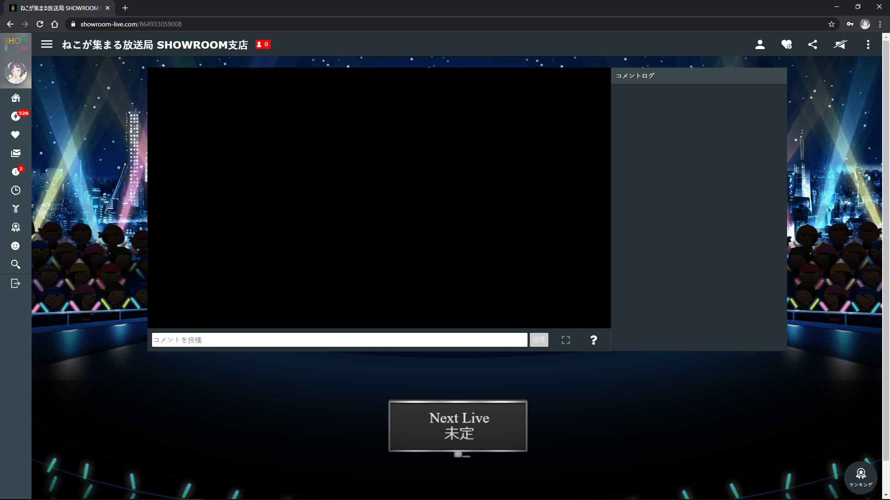

 

# SHOWROOM LivePlayer
SHOWROOMを見やすくする拡張機能です。

[ChromeWebStore](https://chrome.google.com/webstore/detail/showroom-live-player/gcjeljdjmnjhgldhjhomjfacoedjaabg)

## Preview

---

## 開発への参加

### 必要条件
以下を利用して開発に参加することができます。
- Google Chrome 最新版
（どちらもOSは問わないが最新のものであることが条件）

### 使用言語
- CSS3
- JavaScript (VanillaJS)

### 環境構築
1. 最新のリポジトリをDL
2. ブラウザの設定からデベロッパーモード(Chromeのみ)を有効化
3. DLしたファイルを読み込み編集

## ライセンス
MIT

## 作者
AyumuNekozuki / @nekozuki_dev / https://portfolio.nekozuki.me